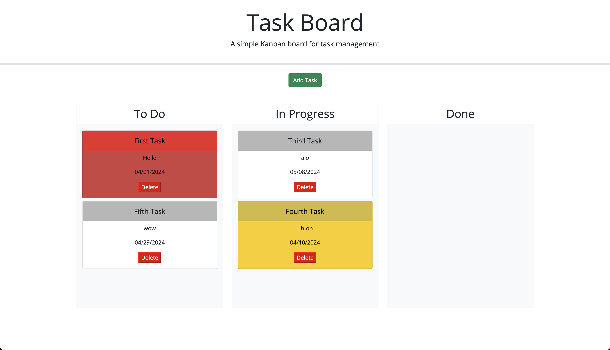

# week-5-challenge

# kanban board

This is a simple kanban/task board.

Users can add a task consisting of a task title, task due date and a task description.

The task will then be created as a card and users will be able to drag them to the three columns.

Card colours will reflect due date proximity and if they're done or not.

Here is a link to the webpage: https://tmw93.github.io/task-board/

Here is an image of the kanban board:
